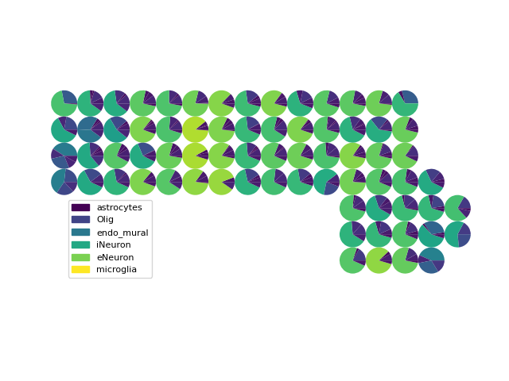
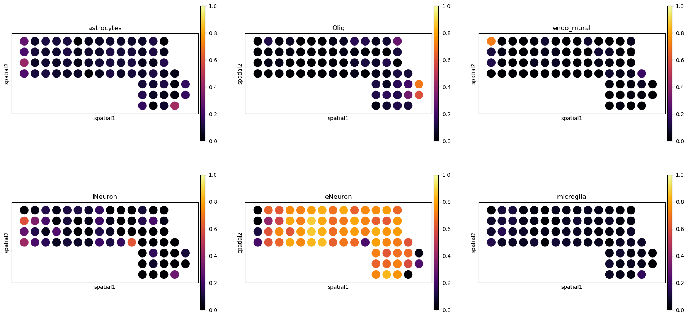

# NLSDeconv: A Cell-type Deconvolution Method for Spatial Transcriptomics Data

## Introduction
NLSDeconv is an efficient cell-type deconvolution method for spatial transcriptomics (ST) data. NLSDeconv outputs an estimate for the proportion of each cell type within each spatial location in the tissue.

NLSDeconv has two implemented algorithm options: **soft-thresholding least squares (SLS)** and **non-negative least squares (NLS)**. SLS is developed as a fast approximation version of NLS, and is recommended for users without GPU access.
To run the algorithms, user needs to provide **an ST dataset** and **an scRNA-seq dataset** (with cell type information).

We provide some example codes for running these algorithms on a seqFISH+ dataset in `main_example.py`. To run this, users will need to first unzip `example_data.zip` to the working directory. Results can be visualized as follows.

<div style="text-align: center;">
  
  
</div>

For more details, please refer to our paper: [NLSDeconv: an efficient cell-type deconvolution method for spatial transcriptomics data](https://www.biorxiv.org/content/10.1101/2024.06.13.598922v1).

## Requirements
NLSDeconv was developed under `python = 3.11` , `PyTorch = 2.0.1`

You can install the rest of the requirements via
`pip install -r requirements.txt`

## Pipeline:
1. Load ST and scRNA-seq datasets separately.
```bash
ad_st = sc.read_h5ad(st_dir)
ad_sc = sc.read_h5ad(sc_dir)
```
2. Preprocess both datasets in sequencing steps including:
 - total count normalization for scRNA-seq dataset
 - removal of cell types with too few cells in that cell type for scRNA-seq dataset
 - selection of top genes characterizing each cell type for scRNA-seq dataset
 - matching genes for ST and scRNA-seq datasets
```bash
ad_st, ad_sc = Preprocess(ad_st, ad_sc, celltype_key='celltype').preprocess()
```
3. Run deconvolution algorithm, SLS or NLS.
 - SLS
 ```bash
 res, time_res, head_res = Deconv(ad_sc, ad_st).SLS()
 ```
 - NLS
 ```bash
# CPU usage
 res, time_res, head_res = Deconv(ad_sc, ad_st, normalization=True).NLS(reg=1e-1, lr=1e-2, warm_start=True, num_epochs=1000, device="cpu")
# GPU usage (e.g. device name cuda:0)
 res, time_res, head_res = Deconv(ad_sc, ad_st, normalization=True).NLS(reg=1e-1, lr=1e-2, warm_start=True, num_epochs=1000, device="cuda:0")
 ```
4. Visulize the deconvolution results.
 - An overall pie plot
 ```bash
 overall_plt(res, head_res, ad_st, spot_size=250, margin_size=400)
 ```
 - Separate figures of each cell type (user can assign the cell types to plot in `show_head_res`) 
 ```bash
 separate_plt(res, head_res, ad_st, show_head_res=head_res, spot_size=400)
 ```

## Function arguments
1. Preprocessing
 - required arguments: `ad_st` (ST dataset read through *scanpy*), `ad_sc` (scRNA-seq dataset read through *scanpy*), `celltype_key` (the column name in `ad_sc.obs` which contains the cell type information).
 - optional arguments:
   - `cellcount_norm` (whether normalize each cell by total counts over all genes): Default is *True*.
   - `cellcount_min` (remove cells with cell types observed less than this number): Default is *2*.
   - `gene_top` (select this number of top genes characterizing each cell type): Default is *200*. 
 - outputs: `ad_st` (preprocessed ST dataset), `ad_sc` (preprocessed scRNA-seq dataset).
2. Deconvolution
 - required arguments: `ad_st` (preprocessed ST dataset), `ad_sc` (preprocessed scRNA-seq dataset).
 - optional arguments:
   - `flist` (assign the ordered list of cell types for deconvolution): Default is *None* (all cell types are considered with no specific requirement of the order).
   - `normalization` (whether divide ST and scRNA-seq count matrices by the overall maximum count): Default is *False*. We recommend *False* for SLS and *True* for NLS.
 - for `.SLS()`: no argument
 - for `.NLS()`, required argument is `lr` (learning rate), optional arguments:
   - `reg` (ridge regularization parameter): Default is *0.*.
   - `warm_start` (whether to use least square estimator as a warm start): Default is *True*.
   - `num_epochs` (number of epochs): Default is *1000*.
   - `device` (device for running the algorithm): Default is *"cpu"*.
 - outputs: `res` (cell-type deconvolution result matrix), `time_res` (algorithm running time), `head_res` (list of cell types corresponding to the column name of the resulting matrix).
3. Visulization
 - required arguments: `res` (cell-type deconvolution result matrix), `head_res` (list of cell types corresponding to the column name of the resulting matrix), `ad_st` (preprocessed ST dataset).
 - for `overall_plt`, arguments for flexibly adjusting figures:
   - `spot_size` (radius of scatters): Suggest to use minimum difference of x/y coordinates as the starting tuning value.
   - `margin_size` (leave extra space for legend): Suggest to use minimum difference of x/y coordinates as the starting tuning value.
   - `file_name` (save the figure to `file_name` under the current directory, e.g. *overall_plt.png*): Default is *None*.
 - for `separate_plt`, arguments for flexibly adjusting figures:
   - `show_head_res` (list of cell types to plot): Default is *None* (plot all cell types).
   - `ncols` (number of plots to show in each row): Default is *3*.
   - `spot_size` (radius of scatters):  Suggest to use minimum difference of x/y coordinates as the starting tuning value.
   - `file_name` (save the figure to `file_name` under the current directory, e.g. *separate_plt.pdf*): Default is *None*.

## References
Datasets were ported from the study: [a comprehensive benchmarking with practical guidelines for cellular deconvolution of spatial transcriptomics](https://zenodo.org/records/10184476).
